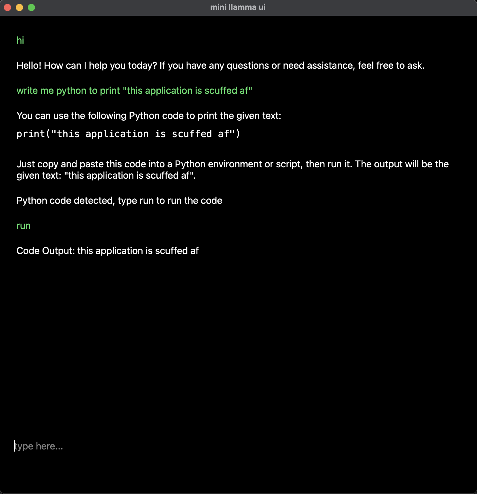

# mini llama ui
A ultra minimalist ui for interacting with ollama built with PyQt5.

The App will also detect any python code and run it with the captured output being shown.

## How to use
Just run `python mini_llammaui.py` and the window will show up.
## Dependencies
[ollama](https://github.com/ollama/ollama)

`pip install pyqt5`